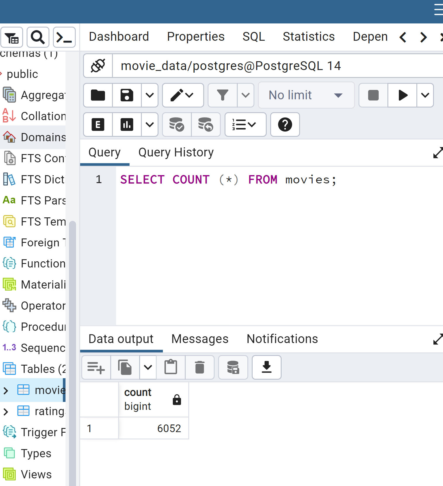
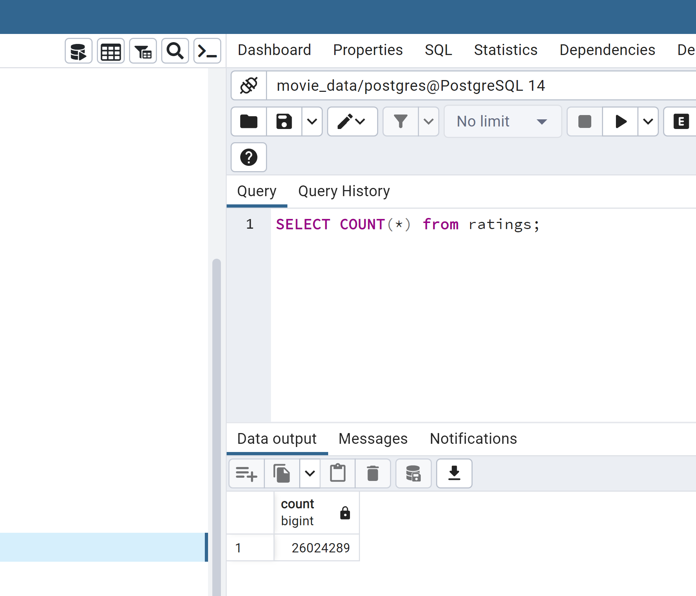
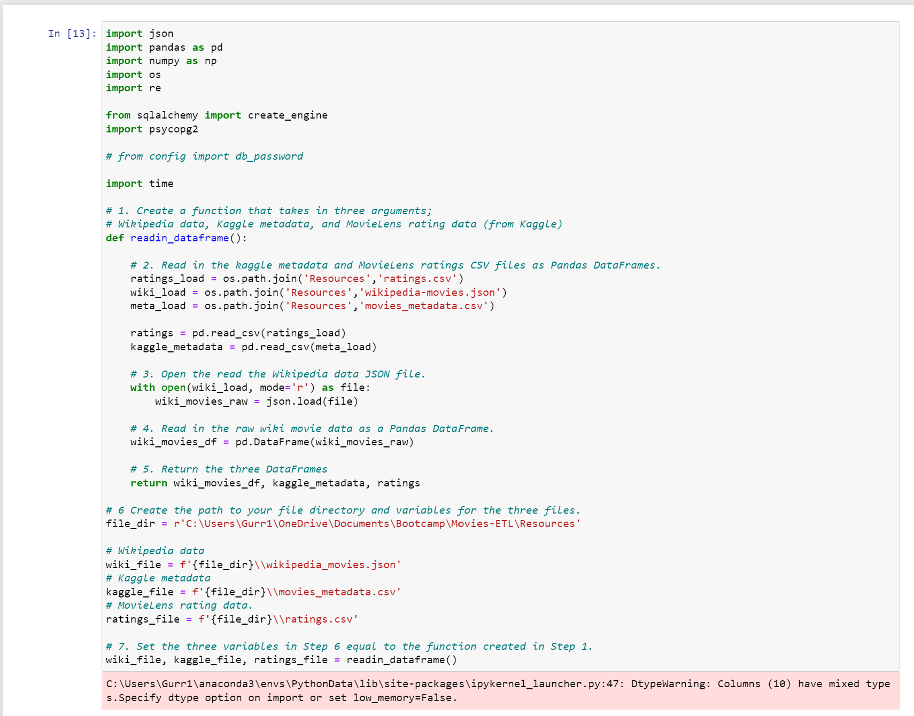
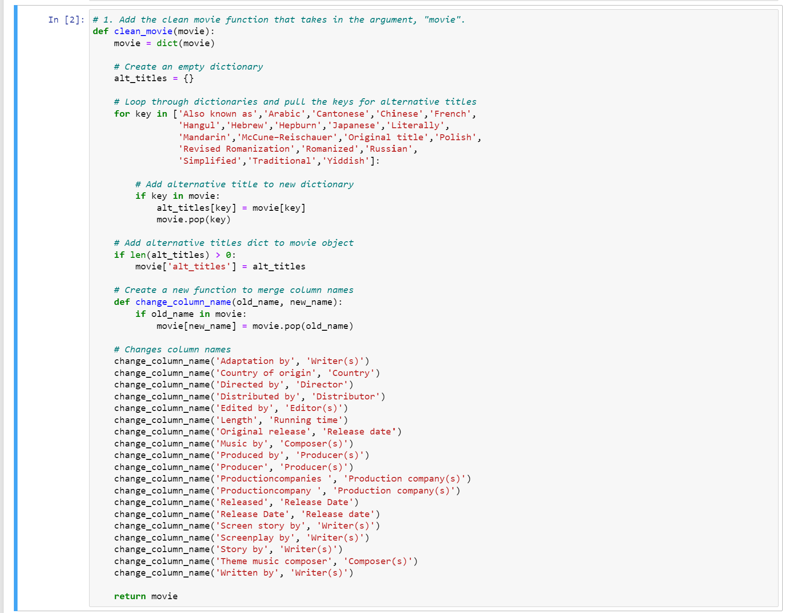
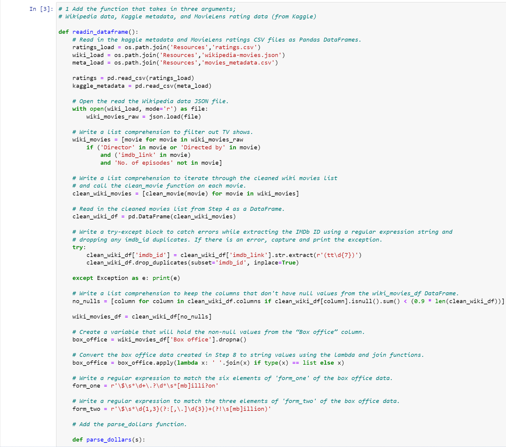
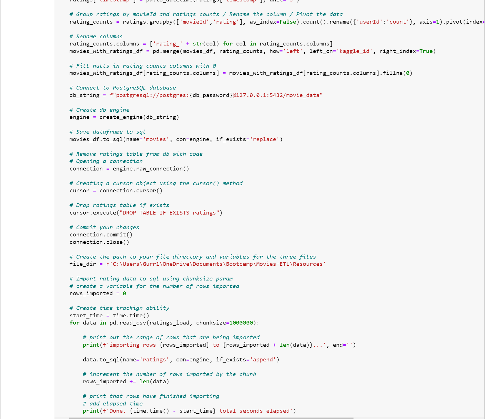

# Movies-ETL

## Overview of Movies Analysis

Amazing Prime, the nation's largest online retailer, wants to develop an algorithm to understand what low-budget movie being released will be popular, so they can buy the rights.  To connect with the local computer community, inspire the team, and have some fun; Amazing Prime wants to hold a hack-a-thon to try to develop the movie algorithm.  Each participant will be provided a movie dataset, and they will be asked to predict the popular movies.  Our Movies-ETL analysis focuses on the process of developing the movie dataset for each participant.
 
### Resources

* Data Source:  wikipedia-movies.json, ratings.csv, movies_metadata.csv
* Software:  Python 3.6.1, Jupyter Notebook (anaconda3), Visual Studio Code 1.38.1
* Packages:  Pandas, NumPy, Os, Json, Re, SQLalchemy, Psycopg2

## Movies Analysis Methdology

To perform this task, we created functions to read and clean two comma-separated-value files and a json wikipedia file.  Those datasets were filtered and merged to create a consolidated movies dataframe.  The merged dataframe was then imported into SQL, and it is the dataset Britta will use at the hack-a-thon.

### Pictures of final results

Count of Movies Records:

Count of Ratings Records:

## Code Snippets

ETL_function_test:

ETL_clean_wiki:

ETL_clean_kaggle:

ETL_create_database:
